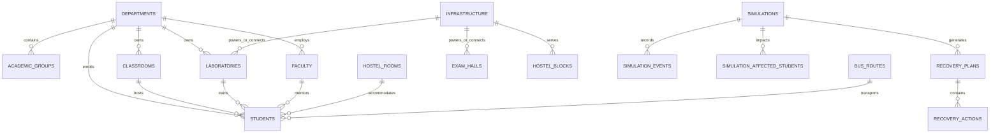

# OMNIS-X Entity-Relationship Diagram

```mermaid
erDiagram
    DEPARTMENTS ||--o{ ACADEMIC_GROUPS : contains
    DEPARTMENTS ||--o{ FACULTY : employs
    DEPARTMENTS ||--o{ CLASSROOMS : owns
    DEPARTMENTS ||--o{ LABORATORIES : owns
    DEPARTMENTS ||--o{ STUDENTS : enrolls

    CLASSROOMS ||--o{ STUDENTS : hosts
    LABORATORIES ||--o{ STUDENTS : trains
    FACULTY ||--o{ STUDENTS : mentors
    HOSTEL_ROOMS ||--o{ STUDENTS : accommodates
    BUS_ROUTES ||--o{ STUDENTS : transports

    INFRASTRUCTURE ||--o{ LABORATORIES : powers_or_connects
    INFRASTRUCTURE ||--o{ EXAM_HALLS : powers_or_connects
    INFRASTRUCTURE ||--o{ HOSTEL_BLOCKS : serves

    SIMULATIONS ||--o{ SIMULATION_EVENTS : records
    SIMULATIONS ||--o{ SIMULATION_AFFECTED_STUDENTS : impacts
    SIMULATIONS ||--o{ RECOVERY_PLANS : generates
    RECOVERY_PLANS ||--o{ RECOVERY_ACTIONS : contains
```
