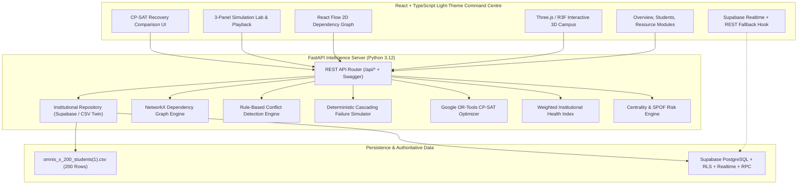

# OMNIS-X System Architecture

```mermaid
flowchart TB
    subgraph Frontend["React + TypeScript Light-Theme Command Centre"]
        UI["Overview, Students, Resource Modules"]
        C3D["Three.js / R3F Interactive 3D Campus"]
        RF["React Flow 2D Dependency Graph"]
        SIMUI["3-Panel Simulation Lab & Playback"]
        OPTUI["CP-SAT Recovery Comparison UI"]
        RT["Supabase Realtime + REST Fallback Hook"]
    end

    subgraph Backend["FastAPI Intelligence Server (Python 3.12)"]
        API["REST API Router (/api/* + Swagger)"]
        REPO["Institutional Repository (Supabase / CSV Twin)"]
        DEP["NetworkX Dependency Graph Engine"]
        CONF["Rule-Based Conflict Detection Engine"]
        CASC["Deterministic Cascading Failure Simulator"]
        OPT["Google OR-Tools CP-SAT Optimizer"]
        HLTH["Weighted Institutional Health Index"]
        RISK["Centrality & SPOF Risk Engine"]
    end

    subgraph Data["Persistence & Authoritative Data"]
        CSV["omnis_x_200_students(1).csv (200 Rows)"]
        SB["Supabase PostgreSQL + RLS + Realtime + RPC"]
    end

    UI & C3D & RF & SIMUI & OPTUI --> API
    RT -.-> SB
    API --> REPO
    API --> DEP & CONF & CASC & OPT & HLTH & RISK
    REPO --> SB
    REPO --> CSV
```
